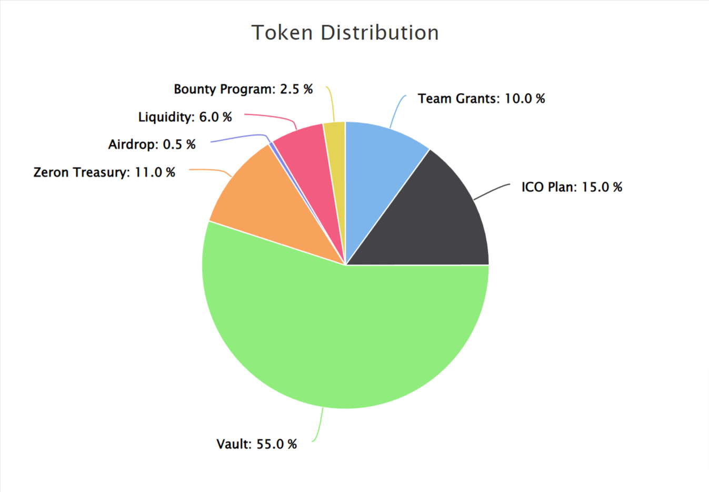

# Token Economics

<figure><figcaption></figcaption></figure>

* 10% Team grants, locked for 3 years.
* 15% ICO Plan.
* 55% Vault, Over a span of 5 years, locked tokens will gradually be released on a monthly basis to support the community.
* 11% Zeron Treasury.
* 6% Add liquidity, Locked liquidity for 2 years. The next round of locking plan are determined by the community vote.
* 2.5% Bounty Program.
* 0.5% Airdrop.
