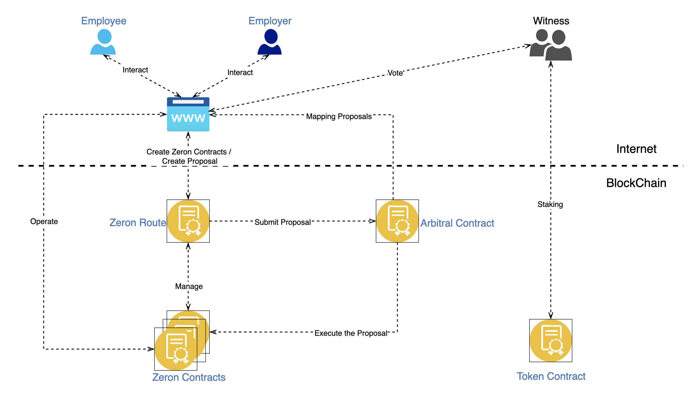

# 🚀 How does Zeron work

<figure><figcaption></figcaption></figure>

Zeron is a decentralized employment protocol that allows for the creation of employment contracts within the crypto-space. Its smart contracts, which are implemented on the Ethereum blockchain, are immutable and cannot be changed or tampered with by anyone, including the original developers. Instead, they are deployed and maintained by the community in a decentralized manner.

When a transaction is initiated, Zeron serves as an agent to hold and release payments for the project in question. Both the employer and employee can access current information about the status of a freelance contract on the Ethereum chain. With Zeron, users can participate in secure and transparent employment agreements in the crypto-space.

<figure><figcaption>
Architecture Overview
</figcaption></figure>

### Where will Zeron Protocol operate?

Zeron Protocol will initially operate on the **Ethereum blockchain**. The protocol will provide diversified payment currencies for six tokens (crvUSD, DAI, cDAI, USDC, BUSD & USDT) handled by the Ethereum blockchain.

Zeron Protocol smart contracts will also be deployed on other side-chains and blockchains. These deployments will allow the tool to support new tokens or benefit from Layer-2 advantages such as faster and cheaper transactions.

According to the project plan, Zeron Protocol will be gradually operating on:

* **Ethereum Blockchain** : **crvUSD**, **DAI**, **cDAI**, **USDC**, **BUSD** & **USDT**,
* **Scroll**, as a Layer-2 **ETH** (Ethereum): **USDC, DAI**.
