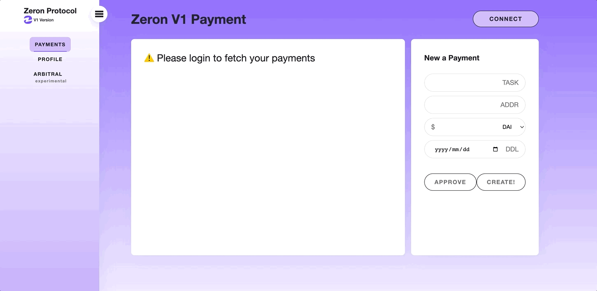
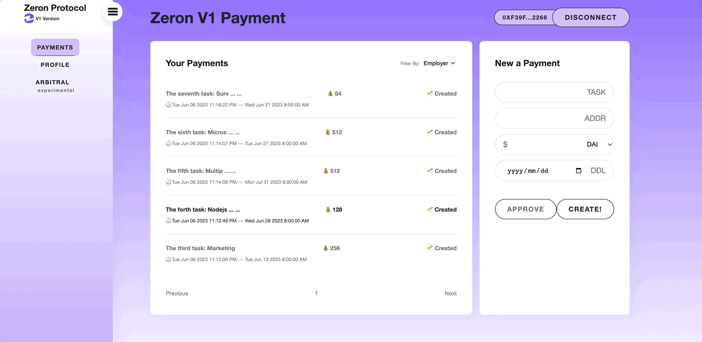
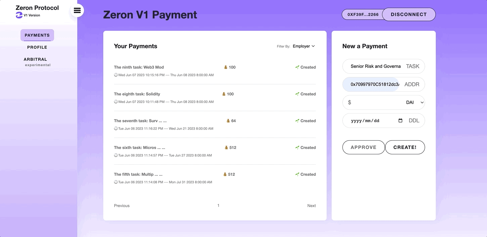
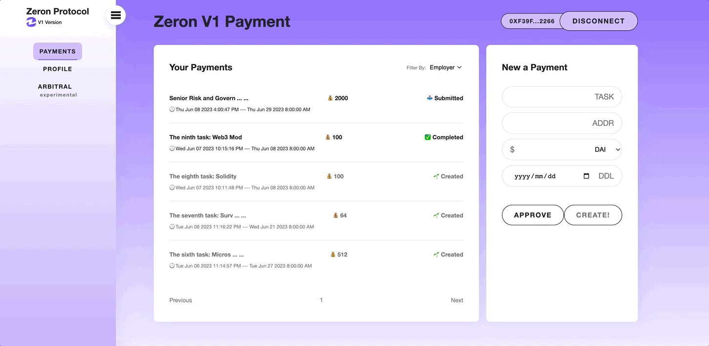
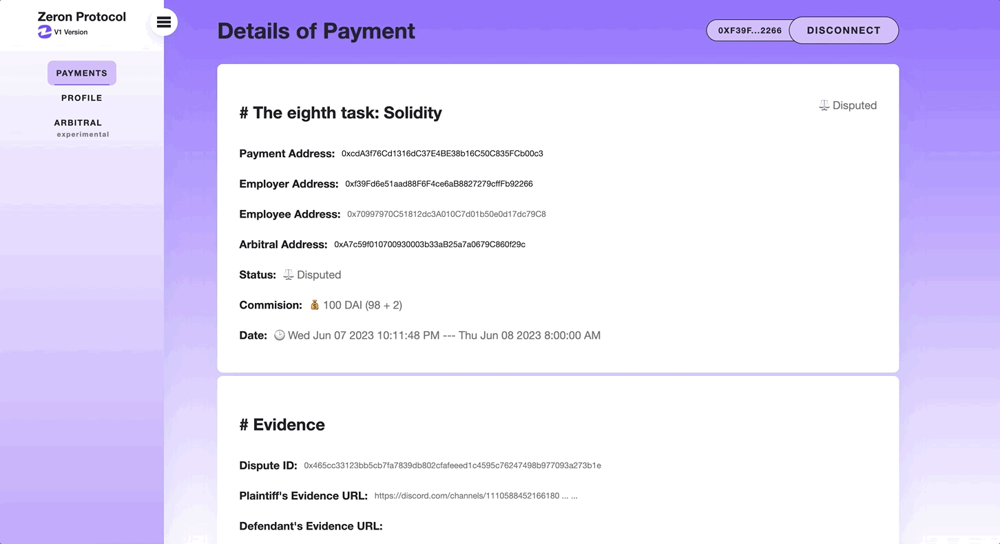
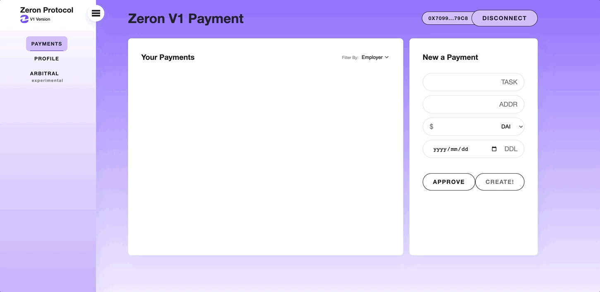
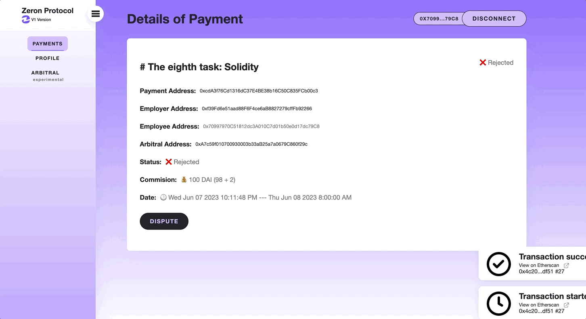

# ✅ Fixed-price Payment

This guide will walk you through the process of creating and managing Zeron Fixed-price payment contracts using the Zeron App. Whether you are an employer or an employee, this guide will explain how to perform various operations based on different payment states.

Zeron Fixed-price payments empowers users to:

* Create fixed-price payment contracts with clear terms and conditions.&#x20;
* Initiate payments and track the status of ongoing transactions.&#x20;
* Handle dispute resolution in case of any disagreements.&#x20;
* Rate and review the performance of employers and employees.&#x20;
* Benefit from the security and transparency of blockchain technology.

By leveraging Zeron Payments, users can streamline their payment processes and ensure trust and fairness in their transactions.

### Accessing the Zeron App

To access the Zeron App, follow these steps:

1. Open your web browser and navigate to [Zeron App Website](https://scroll.zeron.work).
2. On the homepage, click on the "Connect" button.
3. If you already have a wallet connected to your browser, it will automatically connect to Zeron Router. If not, you will be prompted to connect your wallet. Select your preferred wallet provider and follow the instructions to connect.
4. Once your wallet is connected, you will be redirected to the Zeron Payments dashboard.

<figure><figcaption>
Connect Zeron App
</figcaption></figure>

### Dashboard Overview

The ZeronPayments dashboard provides an intuitive interface for interacting with the ZeronPayments smart contract. Here's an overview of the main components:

1. Create Payment: Allows you to create a new payment as an employer.
2. Payment History: Shows a list of past payments made or received.
3. Payment Details: Displays details of any payment.
4. Profile Details: Displays details of any person.

<figure><figcaption>
Overview
</figcaption></figure>

### Performing Actions as an Employer

As an Employer, you have the following options:

#### Create a Payment

To create a payment as an Employer, follow these steps:

1. Enter the brief descrption of task, the employee's EVM address, commision token, commision amount and the deadline of task.
2. Click "Create!" to initiate the payment.

<figure><figcaption>
New a Payment
</figcaption></figure>

#### Approve/Reject Payment Requests

If you receive payment requests from Employees, you can approve or reject them. Here's how:

1. Click the payment entry to the "Detail of Payment" page on the dashboard.
2. Review the results of task off-chain.
3. Click "Approve" to pay the commission or "Reject" to reject it.

<figure><figcaption>
Approve the payment
</figcaption></figure>

<figure><figcaption>
Reject the payment
</figcaption></figure>

#### Dispute a Payment

Submit the evidence as a defendant for arbitration, follow these steps:

1. Click the payment entry to the "Detail of Payment" page on the dashboard.
2. Check and confirm that the payment's status is "Disputed".
3. Submit/Update defendant's evidence URL.&#x20;


Evidence can be published to [#🕵-evidence](https://discord.com/channels/1110588452166180884/1111192950244921345) what is a official evidence locker.


<figure><figcaption>
Submit/update the evidence  as a defendant
</figcaption></figure>

#### Refund a Payment

If the payment's status is "Created" or remains "InProgress" beyond the deadline by two weeks without any action taken by the Employee, or if the payment is in the "Rejected" state and the Employee has not initiated a dispute within two months, you can send a "Refund" request to withdraw the commission and cancel the Payment., follow these steps:

1. Click the payment entry to the "Detail of Payment" page on the dashboard.
2. Check and confirm that the payment's status is 'Submitted' and the deadline has passed for more than two weeks.
3. Click "Refund" button to withdraw all the commission and cancel the payment.

### Performing Actions as an Employee

As an Employee, you have the following options:

#### Sign a Payment

To sign a payment as an Employee for accept the payment, follow these steps:

1. Click the payment entry to the "Detail of Payment" page on the dashboard.
2. Confirm the parameters of payment.
3. Click "Sign" button to accept the payment if everythings expected.

<figure><figcaption>
Sign the payment
</figcaption></figure>

#### Submit a Payment

To submit a payment as an Employee for request the Employer approve, follow these steps:

1. Click the payment entry to the "Detail of Payment" page on the dashboard.
2. Click "Submit" to send the approve request, once the task has been already completed.

<figure><figcaption>
Submit the payment
</figcaption></figure>

#### Dispute a Payment

To raise a dispute for the payment as a Plaintiff and submit the evidence for arbitration, follow these steps:

1. Click the payment entry to the "Detail of Payment" page on the dashboard.
2. Click "Dispute" button to start a dispute for the payment.
3. Submit/Update plaintiff's evidence URL.&#x20;


Evidence can be published to [#🕵-evidence](https://discord.com/channels/1110588452166180884/1111192950244921345) what is a official evidence locker.


<figure><figcaption>
Start a dispute and submit/update the evidence as a plaintiff
</figcaption></figure>

#### Withdraw Funds

If the payment's status remains stuck in 'Submitted' for more than two weeks without any action from the Employer, you can send the 'Withdraw' request to extract all the commission., follow these steps:

1. Click the payment entry to the "Detail of Payment" page on the dashboard.
2. Check and confirm that the payment status is 'Submitted' and the deadline has passed for more than two weeks.
3. Click "Withdraw" button to extract all the commission from the payment.

### Troubleshooting

If you encounter any issues or have questions while using the Zeron App, please reach out to [#💁-help](https://discord.com/channels/1110588452166180884/1110767138240725003) for assistance.

### Conclusion

Congratulations! You have learned how to use the Zeron App to interact with the Zeron Fixed-price payments contract. Whether you are an Employer or an Employee, you can now manage payments, and perform other actions seamlessly through the UI. Enjoy the benefits of secure and transparent payments with Zeron App!&#x20;


The screenshot above is for illustrative purposes only and may not reflect the actual UI.

