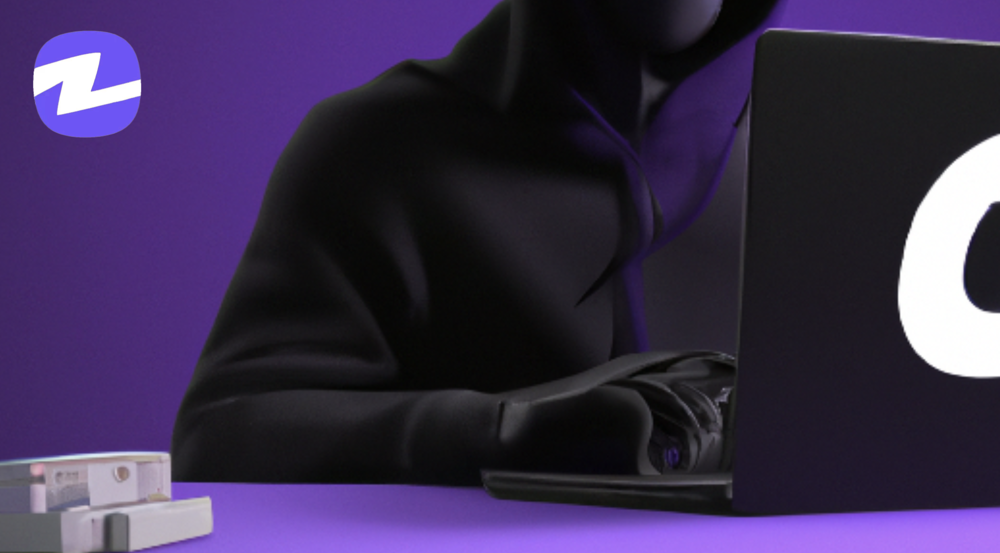

# 💡 Introduction to Zeron

<figure><figcaption></figcaption></figure>

As advancements in Web2 and Web3 technologies continue to bring the world closer together and provide an open-source environment for opportunities and information, many individuals around the globe still lack access to quality career opportunities. This lack is not due to a shortage of job availability, but rather the limitations of contracting and payment methods. While there are many freelancer platforms available on the internet, high service fees and limited jurisdiction prevent them from fully meeting the needs of freelancers, employers, and young professionals.

Zeron Protocol is a decentralized employment protocol that utilizes trustless escrow contracts to allow users to hire and attract talent using crypto-assets. It also has a decentralized arbitration tribunal to resolve subjective disputes. Employers and Employees who successfully find and secure work through the platform will be rewarded.
